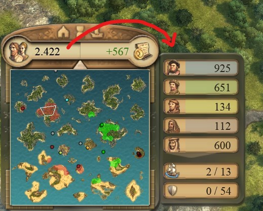

# Anno 1404 Calculator

* A calculator for the computer game [Anno 1404](https://store.ubi.com/upc/de/anno-1404-history-edition/5e29c6565cdf9a03ec037ae7.html) to compute the required production depending on the population 
* [YouTube-Tutorial](https://youtu.be/4ZJYZ5GBc60)
* To use the calculator go to the following website: https://nihoel.github.io/Anno1404Calculator/
* To use it offline, download, unzip and open index.html with a browser: https://github.com/NiHoel/Anno1404Calculator/archive/v1.0.zip

An application to read population and factory count from the game and enter it into the calculator (only works from citizens onwards): https://github.com/NiHoel/Anno1404UXEnhancer 

* License: MIT
* Author: Nico Höllerich
